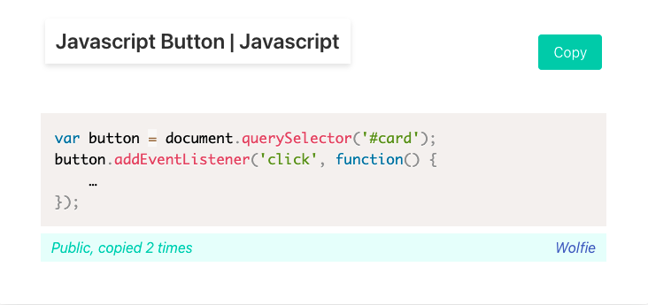

# Code Red Wolf (code snippet sharing app)

The primary function of our app is for users to post and share code snippets. Each user has a public profile with the snippets that they've created and shared. After posting or copying a snippet the user has the ability to edit their snippets, and choose whether to share or hold it in a private library. A snippet displays the number of times it has been copied as well as a link back to the user profile from which it was copied. The user also has the ability to search through global snippets as well as their own. 

## Installation 

To run our app, download the project from github.
Make sure you have pipenv installed on you OS. To do this run:
```pip install --user pipenv``` in your terminal.

Navigate to your project file.

Next install dependencies in project pipfile:
```pipenv install```

Start your environment:

```pipenv shell```
 
Migrate models to database:

```python manage.py migrate```

Finally, run the server and start the app:

```python manage.py runserver```

## Contributing

Pull requests are welcome. For major changes, please open an issue first to discuss what you would like to change.
Please make sure to update tests as appropriate.